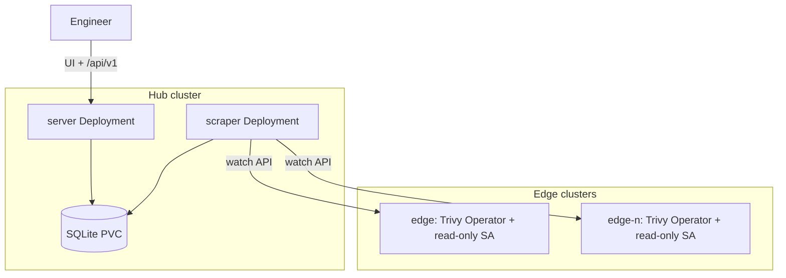
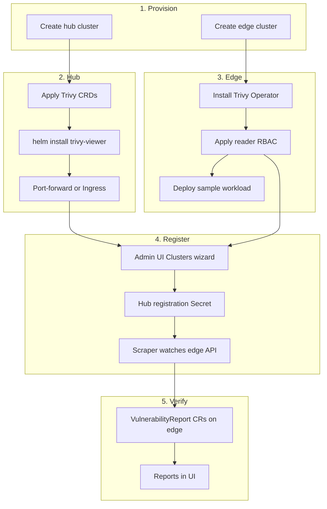

# Trivy Viewer

**Trivy Viewer** is a hub-pull security dashboard that aggregates Trivy Operator reports (`VulnerabilityReport`, `SbomReport`) from many Kubernetes clusters into one SQLite-backed API and embedded web UI.

**Hub-pull:** collectors run only on the hub. Edge clusters need Trivy Operator CRDs, the operator (or existing report CRs), and a read-only `ServiceAccount` — no agent pod on each edge.

## Architecture



## End-to-end setup flow



## Features

| Feature | Status |
|---------|--------|
| Single binary (`--mode server` \| `scraper`) | done |
| SQLite storage (WAL, migrations) | done |
| Multi-cluster hub-pull (Secret watcher + per-cluster informers) | done |
| REST API `/api/v1` (dashboard, reports, SBOM, hub cluster CRUD) | done |
| Embedded React UI | done |
| Helm chart (server + scraper, shared PVC, RBAC) | done |
| OIDC / auth | planned |
| PostgreSQL backend | planned |

## Quick start (Helm)

Install on the **hub** cluster:

```bash
kubectl apply -f examples/kind/trivy-crds.yaml

helm install trivy-viewer charts/trivy-viewer \
  --namespace trivy-system --create-namespace
```

Expose the UI (port-forward, Ingress, or LoadBalancer):

```bash
kubectl -n trivy-system port-forward svc/trivy-viewer-server 3000:3000
```

The UI stays empty until you **register edge clusters** (below) and the operator has created report CRs on those edges.

## Register edge clusters via Admin UI

Open the UI → **Admin** → **Clusters** (`/admin/clusters`).

### Step 1 — Bootstrap on edge

| Field | Example (Kind) | Notes |
|-------|----------------|-------|
| Cluster name | `edge-1` | DNS-1123 label; shown on the dashboard |
| Edge namespace | `trivy-system` | Where the reader SA lives (same as operator namespace is OK) |
| Context | `kind-edge` | Your `kubectl` context for the edge cluster |

**1-a — Apply on edge** (admin kubeconfig):

```bash
kubectl --context kind-edge apply -f examples/kind/edge-reader-rbac.yaml
```

Or paste the manifest from the wizard (it matches the example file).

**1-b — Extract credentials** (run on your workstation):

```bash
EDGE_CTX=kind-edge
EDGE_NS=trivy-system

TOKEN=$(kubectl --context "$EDGE_CTX" -n "$EDGE_NS" \
  get secret trivy-viewer-reader-token -o jsonpath='{.data.token}' | base64 -d)

CA=$(kubectl --context "$EDGE_CTX" -n "$EDGE_NS" \
  get secret trivy-viewer-reader-token -o jsonpath='{.data.ca\.crt}')

SERVER=$(kubectl --context "$EDGE_CTX" config view --minify \
  -o jsonpath='{.clusters[0].cluster.server}')

echo "server:  $SERVER"
echo "ca:      $CA"
echo "token:   $TOKEN"

kubectl --context "$EDGE_CTX" --token "$TOKEN" \
  auth can-i list vulnerabilityreports --all-namespaces
```

Click **Next: Register →** in the wizard.

### Step 2 — Register on hub

| Field | Source | Kind tip |
|-------|--------|----------|
| API server URL | `SERVER` from step 1-b | e.g. `https://127.0.0.1:6444` when the edge API is exposed on a host port |
| CA certificate | `CA` (base64) | Paste the full base64 string |
| Bearer token | `TOKEN` | Read-only SA token |
| Skip TLS verify | checkbox | Enable for Kind/local if the hub pod cannot validate the edge API certificate |

Click **Register cluster**. The hub creates a Secret labelled `trivy-viewer.io/secret-type=cluster`. The scraper attaches within seconds; **Registered Clusters** shows **Synced** once reports are in the database (typically 30–90s after CRs exist on the edge).

### Kind networking

The hub scraper pod must reach the edge Kubernetes API URL. With [multi-cluster Kind](examples/README.md), expose the edge API on a host port (`examples/kind/cluster-edge.yaml` uses `6444`) and register that URL. From inside the hub cluster, use the Docker bridge IP of the edge control-plane node or `host.docker.internal:<port>` if reachable.

### API alternative

```bash
curl -sS -X POST http://localhost:3000/api/v1/hub/clusters \
  -H 'Content-Type: application/json' \
  -d '{
    "name": "edge-1",
    "server": "https://127.0.0.1:6444",
    "ca_data": "<base64-ca>",
    "bearer_token": "<token>",
    "insecure": true
  }'
```

Prefer the Admin UI wizard for day-to-day use.

## Try locally with Kind

After you understand the flow above:

1. Follow [examples/README.md](examples/README.md) — create hub + edge, `kubectl apply`, Helm, operator.
2. Complete **Register edge clusters via Admin UI** (this README).
3. Verify reports on the dashboard.

| Hub mode | Edge | Hub |
|----------|------|-----|
| Hub-pull only | `install-edge.sh` + reader RBAC | CRDs + trivy-viewer Helm |
| Hub + local scans | operator on edges | operator on hub **or** CRDs + `watchLocal` |

## Build from source

```bash
go build -o bin/trivy-viewer ./cmd/trivy-viewer
go test ./...
cd web && npm ci && npm run build   # embeds UI into internal/web/static
```

## CI

On push/PR to `main`: Go vet, unit tests + coverage, web build, Helm lint/template, golangci-lint.

On tag `v*`: multi-arch image push to GHCR.

[Dependabot](https://docs.github.com/en/code-security/dependabot) updates GitHub Actions, Go modules, npm (`web/`), and the root `Dockerfile` weekly.

## Development

Maintainers use local-only paths (not published on GitHub): `docs/`, `e2e/`, and `Makefile`. See [AGENTS.md](AGENTS.md).

## Troubleshooting

| Symptom | Fix |
|---------|-----|
| UI empty after Helm | Register edges in **Admin → Clusters** |
| No reports after register | Install Trivy Operator on the edge ([examples/README.md](examples/README.md)); deploy `examples/kind/demo-workload.yaml`; wait 1–5 minutes for CRs |
| Edge unreachable from hub | Check API server URL, host networking, TLS / **Skip TLS verify** |
| Cluster not Synced | Confirm `kubectl get vulnerabilityreports -A` on the edge; check scraper logs on the hub |

Trivy Viewer reads **Trivy Operator CRs**, not Pods directly.

## License

MIT — see [LICENSE](LICENSE). The embedded React UI is derived from
[younsl/o](https://github.com/younsl/o) (MIT); see the third-party notice in
the license file.
